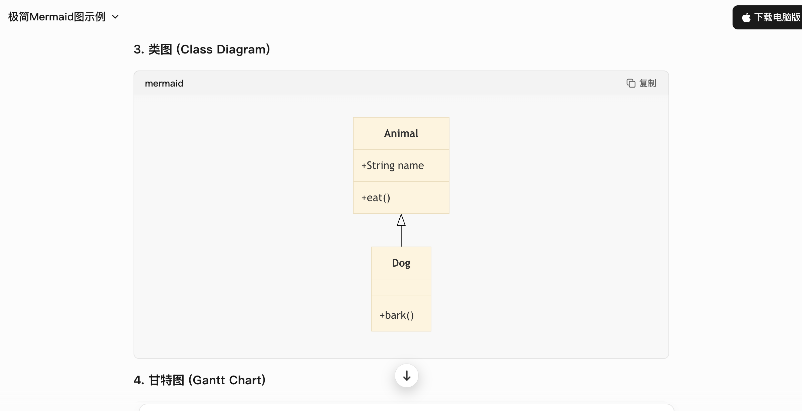
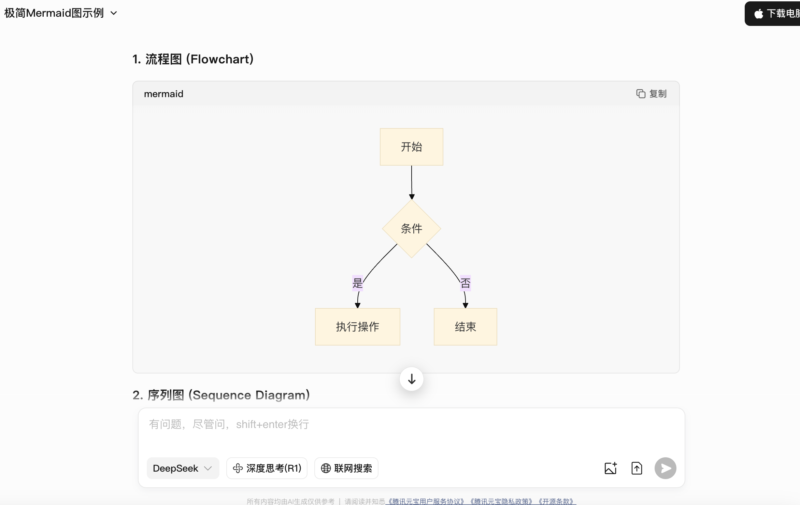
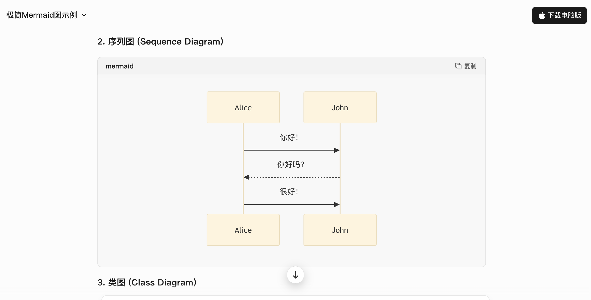
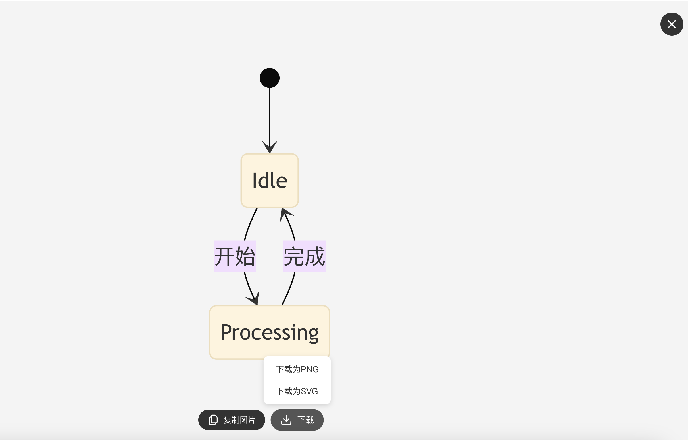
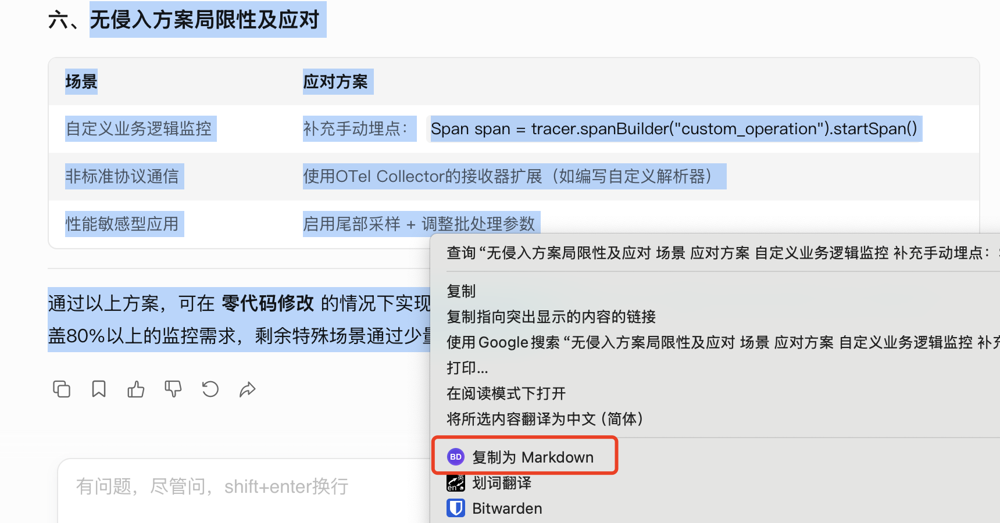

# 🚀 Better DeepSeek

基于WXT的浏览器扩展，提供网页增强功能。

## ✨ 功能特点

- 自动加载远程配置，无需手动设置
- 按照URL匹配规则在特定网站自动执行预定义动作
- 支持Mermaid图表渲染
- 支持HTML复制为Markdown
- 简洁的用户界面
- 目前支持DeepSeek官网以及元宝平台使用

## 📸 预览

## 📥 安装

1. 下载最新版本的扩展
2. 在Chrome/Edge浏览器中打开扩展管理页面
3. 启用开发者模式
4. 拖拽扩展文件到扩展管理页面

## 💻 开发

本项目使用[WXT](https://wxt.dev/)框架开发。
